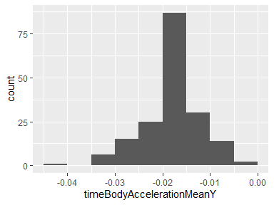
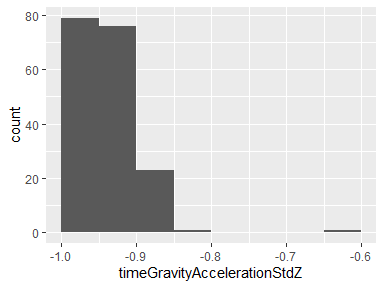
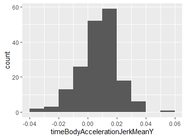

Human Activity Recognition Using Smartphones Dataset (Version 1.0) -
Code Book
================

### Review

Human Activity Recognition database built from the recordings of 30
subjects performing activities of daily living (ADL) while carrying a
waist-mounted smartphone with embedded inertial sensors.

## Description of the experiments

The experiments were carried out by Davide Anguita et al\[1\], with a
group of 30 volunteers within an age bracket of 19-48 years. Each person
performed six activities of daily living (*walking*, *walking upstairs*,
*walking downstairs*, *sitting*, *standing* and *laying*) wearing a
smartphone (Samsung Galaxy S II) on the waist. Using its embedded
accelerometer and gyroscope, they captured 3-axial linear acceleration
and 3-axial angular velocity at a constant rate of 50Hz. The experiments
were video-recorded to label the data manually. The obtained dataset has
been randomly partitioned into two sets, where 70% of the volunteers was
selected for generating the training data and 30% the test data.

The sensor signals (accelerometer and gyroscope) were pre-processed by
applying noise filters and then sampled in fixed-width sliding windows
of 2.56 sec and 50% overlap (128 readings/window). The sensor
acceleration signal, which has gravitational and body motion components,
was separated using a Butterworth low-pass filter into body acceleration
and gravity. The gravitational force is assumed to have only low
frequency components, therefore a filter with 0.3 Hz cutoff frequency
was used. From each window, a vector of features was obtained by
calculating variables from the time and frequency domain.

A video of the experiment including an example of the 6 recorded
activities with one of the participants can be seen in the following
[link](http://archive.ics.uci.edu/ml/datasets/Smartphone-Based+Recognition+of+Human+Activities+and+Postural+Transitions).

## Feature Selection

The features selected for this database come from the accelerometer and
gyroscope 3-axial raw signals time acceleration (on three axes) and time
gyroscope (on three axes). These time domain signals were captured at a
constant rate of 50 Hz. Then, they were filtered using a median filter
and a 3rd order low pass Butterworth filter with a corner frequency of
20 Hz to remove noise. Similarly, the acceleration signal was then
separated into body and gravity acceleration signals
(timeBodyAcceleration and timeGravityAcceleration) using another low
pass Butterworth filter with a corner frequency of 0.3 Hz.

Subsequently, the body linear acceleration and angular velocity were
derived in time to obtain Jerk signals (timeBodyAccelerationJerk and
timeBodyGyroscopeJerk). Also the magnitude of these three-dimensional
signals were calculated using the Euclidean norm
(timeBodyAccelerationMag, timeGravityAccelerationMag,
timeBodyAccelerationJerkMag, timeBodyGyroscopeMag and
timeBodyGyroscopeJerkMag).

Finally a Fast Fourier Transform (FFT) was applied to some of these
signals producing frequencyBodyAcceleration (on three axes),
frequencyBodyAccelerationJerk (on three axes), frequencyBodyGyroscope
(on three axes), frequencyBodyAccelerationJerkMag,
frequencyBodyGyroscopeMag and frequencyBodyGyroscopeJerkMag.

These signals were used to estimate variables of the feature vector for
each pattern: ‘XYZ’ is used to denote 3-axial signals in the X, Y and Z
directions:

  - Features are normalized and bounded within \[-1,1\].
  - The units used for the accelerations (total and body) are ’g’s
    (gravity of earth -\> 9.80665 m/seg2).
  - The gyroscope units are rad/seg.

The set of variables that were estimated from these signals were
summarized into:

  - Mean value
  - Standard deviation

# Data processing

The **raw files**, downloaded from this
[link](https://d396qusza40orc.cloudfront.net/getdata%2Fprojectfiles%2FUCI%20HAR%20Dataset.zip)
on 2020-08-31, where preprocessed to generate the tidy dataset saved to
**tidy\_dataset.txt**, which contains the mean value for all of the
mentioned variables, grouped by activity and subject. The **README.md**
file describes the steps to generate that dataset from the zip file.

# Data report overview

The dataset generated called **tidy\_dataset.txt** has the following
dimensions:

| Feature                | Result |
| :--------------------- | -----: |
| Number of observations |    180 |
| Number of variables    |     68 |

| Feature Name                              | Unit    | Type      | Description                                                                                                                                                             |
| :---------------------------------------- | :------ | :-------- | :---------------------------------------------------------------------------------------------------------------------------------------------------------------------- |
| 1\. activity                              |         | Character | Activities performed by each person wearing a smartphone Samsung Galaxy S II on the waist: walking, walking upstairs, walking downstairs, sitting, standing and laying. |
| 2\. subject                               |         | Integer   | The thirty people who participated in the experiments numbered from 1 to 30.                                                                                            |
| 3\. timeBodyAccelerationMeanX             | g       | Numeric   | Mean value of body acceleration signal in the time domain on X axis. Normalized and bounded value within \[-1,1\].                                                      |
| 4\. timeBodyAccelerationMeanY             | g       | Numeric   | Mean value of body acceleration signal in the time domain on Y axis. Normalized and bounded value within \[-1,1\].                                                      |
| 5\. timeBodyAccelerationMeanZ             | g       | Numeric   | Mean value of body acceleration signal in the time domain on Z axis. Normalized and bounded value within \[-1,1\].                                                      |
| 6\. timeBodyAccelerationStdX              | g       | Numeric   | Standard deviation value of body acceleration signal in the time domain on X axis. Normalized and bounded value within \[-1,1\].                                        |
| 7\. timeBodyAccelerationStdY              | g       | Numeric   | Standard deviation value of body acceleration signal in the time domain on Y axis. Normalized and bounded value within \[-1,1\].                                        |
| 8\. timeBodyAccelerationStdZ              | g       | Numeric   | Standard deviation value of body acceleration signal in the time domain on Z axis. Normalized and bounded value within \[-1,1\].                                        |
| 9\. timeGravityAccelerationMeanX          | g       | Numeric   | Mean value of gravity acceleration signal in the time domain on X axis. Normalized and bounded value within \[-1,1\].                                                   |
| 10\. timeGravityAccelerationMeanY         | g       | Numeric   | Mean value of gravity acceleration signal in the time domain on Y axis. Normalized and bounded value within \[-1,1\].                                                   |
| 11\. timeGravityAccelerationMeanZ         | g       | Numeric   | Mean value of gravity acceleration signal in the time domain on Z axis. Normalized and bounded value within \[-1,1\].                                                   |
| 12\. timeGravityAccelerationStdX          | g       | Numeric   | Standard deviation value of gravity acceleration signal in the time domain on X axis. Normalized and bounded value within \[-1,1\].                                     |
| 13\. timeGravityAccelerationStdY          | g       | Numeric   | Standard deviation value of gravity acceleration signal in the time domain on Y axis. Normalized and bounded value within \[-1,1\].                                     |
| 14\. timeGravityAccelerationStdZ          | g       | Numeric   | Standard deviation value of gravity acceleration signal in the time domain on Z axis. Normalized and bounded value within \[-1,1\].                                     |
| 15\. timeBodyAccelerationJerkMeanX        | g       | Numeric   | Mean value of body acceleration Jerk signal in the time domain on X axis. Normalized and bounded value within \[-1,1\].                                                 |
| 16\. timeBodyAccelerationJerkMeanY        | g       | Numeric   | Mean value of body acceleration Jerk signal in the time domain on Y axis. Normalized and bounded value within \[-1,1\].                                                 |
| 17\. timeBodyAccelerationJerkMeanZ        | g       | Numeric   | Mean value of body acceleration Jerk signal in the time domain on Z axis. Normalized and bounded value within \[-1,1\].                                                 |
| 18\. timeBodyAccelerationJerkStdX         | g       | Numeric   | Standard deviation value of body acceleration Jerk signal in the time domain on X axis. Normalized and bounded value within \[-1,1\].                                   |
| 19\. timeBodyAccelerationJerkStdY         | g       | Numeric   | Standard deviation value of body acceleration Jerk signal in the time domain on Y axis. Normalized and bounded value within \[-1,1\].                                   |
| 20\. timeBodyAccelerationJerkStdZ         | g       | Numeric   | Standard deviation value of body acceleration Jerk signal in the time domain on Z axis. Normalized and bounded value within \[-1,1\].                                   |
| 21\. timeBodyGyroscopeMeanX               | rad/seg | Numeric   | Mean value of body gyroscope signal in the time domain on X axis. Normalized and bounded value within \[-1,1\].                                                         |
| 22\. timeBodyGyroscopeMeanY               | rad/seg | Numeric   | Mean value of body gyroscope signal in the time domain on Y axis. Normalized and bounded value within \[-1,1\].                                                         |
| 23\. timeBodyGyroscopeMeanZ               | rad/seg | Numeric   | Mean value of body gyroscope signal in the time domain on Z axis. Normalized and bounded value within \[-1,1\].                                                         |
| 24\. timeBodyGyroscopeStdX                | rad/seg | Numeric   | Standard deviation value of body gyroscope signal in the time domain on X axis. Normalized and bounded value within \[-1,1\].                                           |
| 25\. timeBodyGyroscopeStdY                | rad/seg | Numeric   | Standard deviation value of body gyroscope signal in the time domain on Y axis. Normalized and bounded value within \[-1,1\].                                           |
| 26\. timeBodyGyroscopeStdZ                | rad/seg | Numeric   | Standard deviation value of body gyroscope signal in the time domain on Z axis. Normalized and bounded value within \[-1,1\].                                           |
| 27\. timeBodyGyroscopeJerkMeanX           | rad/seg | Numeric   | Mean value of body gyroscope Jerk signal in the time domain on X axis. Normalized and bounded value within \[-1,1\].                                                    |
| 28\. timeBodyGyroscopeJerkMeanY           | rad/seg | Numeric   | Mean value of body gyroscope Jerk signal in the time domain on Y axis. Normalized and bounded value within \[-1,1\].                                                    |
| 29\. timeBodyGyroscopeJerkMeanZ           | rad/seg | Numeric   | Mean value of body gyroscope Jerk signal in the time domain on Z axis. Normalized and bounded value within \[-1,1\].                                                    |
| 30\. timeBodyGyroscopeJerkStdX            | rad/seg | Numeric   | Standard deviation value of body gyroscope Jerk signal in the time domain on X axis. Normalized and bounded value within \[-1,1\].                                      |
| 31\. timeBodyGyroscopeJerkStdY            | rad/seg | Numeric   | Standard deviation value of body gyroscope Jerk signal in the time domain on Y axis. Normalized and bounded value within \[-1,1\].                                      |
| 32\. timeBodyGyroscopeJerkStdZ            | rad/seg | Numeric   | Standard deviation value of body gyroscope Jerk signal in the time domain on Z axis. Normalized and bounded value within \[-1,1\].                                      |
| 33\. timeBodyAccelerationMagMean          | g       | Numeric   | Mean value of magnitude of body acceleration signal in the time domain. Normalized and bounded value within \[-1,1\].                                                   |
| 34\. timeBodyAccelerationMagStd           | g       | Numeric   | Standard deviation value of magnitude of body acceleration signal in the time domain. Normalized and bounded value within \[-1,1\].                                     |
| 35\. timeGravityAccelerationMagMean       | g       | Numeric   | Mean value of magnitude of gravity acceleration signal in the time domain. Normalized and bounded value within \[-1,1\].                                                |
| 36\. timeGravityAccelerationMagStd        | g       | Numeric   | Standard deviation value of magnitude of gravity acceleration signal in the time domain. Normalized and bounded value within \[-1,1\].                                  |
| 37\. timeBodyAccelerationJerkMagMean      | g       | Numeric   | Mean value of magnitude of body acceleration Jerk signal in the time domain. Normalized and bounded value within \[-1,1\].                                              |
| 38\. timeBodyAccelerationJerkMagStd       | g       | Numeric   | Mean value of magnitude of body acceleration Jerk signal in the time domain. Normalized and bounded value within \[-1,1\].                                              |
| 39\. timeBodyGyroscopeMagMean             | rad/seg | Numeric   | Mean value of magnitude of body gyroscope signal in the time domain. Normalized and bounded value within \[-1,1\].                                                      |
| 40\. timeBodyGyroscopeMagStd              | rad/seg | Numeric   | Standard deviation value of magnitude of body gyroscope signal in the time domain. Normalized and bounded value within \[-1,1\].                                        |
| 41\. timeBodyGyroscopeJerkMagMean         | rad/seg | Numeric   | Mean value of magnitude of body gyroscope Jerk signal in the time domain. Normalized and bounded value within \[-1,1\].                                                 |
| 42\. timeBodyGyroscopeJerkMagStd          | rad/seg | Numeric   | Standard deviation value of magnitude of body gyroscope Jerk signal in the time domain. Normalized and bounded value within \[-1,1\].                                   |
| 43\. frequencyBodyAccelerationMeanX       | g       | Numeric   | Mean value of body acceleration signal in the frequency domain on X axis. Normalized and bounded value within \[-1,1\].                                                 |
| 44\. frequencyBodyAccelerationMeanY       | g       | Numeric   | Mean value of body acceleration signal in the frequency domain on Y axis. Normalized and bounded value within \[-1,1\].                                                 |
| 45\. frequencyBodyAccelerationMeanZ       | g       | Numeric   | Mean value of body acceleration signal in the frequency domain on Z axis. Normalized and bounded value within \[-1,1\].                                                 |
| 46\. frequencyBodyAccelerationStdX        | g       | Numeric   | Standard deviation value of body acceleration signal in the frequency domain on X axis. Normalized and bounded value within \[-1,1\].                                   |
| 47\. frequencyBodyAccelerationStdY        | g       | Numeric   | Standard deviation value of body acceleration signal in the frequency domain on Y axis. Normalized and bounded value within \[-1,1\].                                   |
| 48\. frequencyBodyAccelerationStdZ        | g       | Numeric   | Standard deviation value of body acceleration signal in the frequency domain on Z axis. Normalized and bounded value within \[-1,1\].                                   |
| 49\. frequencyBodyAccelerationJerkMeanX   | g       | Numeric   | Mean value of body acceleration Jerk signal in the frequency domain on X axis. Normalized and bounded value within \[-1,1\].                                            |
| 50\. frequencyBodyAccelerationJerkMeanY   | g       | Numeric   | Mean value of body acceleration Jerk signal in the frequency domain on Y axis. Normalized and bounded value within \[-1,1\].                                            |
| 51\. frequencyBodyAccelerationJerkMeanZ   | g       | Numeric   | Mean value of body acceleration Jerk signal in the frequency domain on Z axis. Normalized and bounded value within \[-1,1\].                                            |
| 52\. frequencyBodyAccelerationJerkStdX    | g       | Numeric   | Standard deviation value of body acceleration Jerk signal in the frequency domain on X axis. Normalized and bounded value within \[-1,1\].                              |
| 53\. frequencyBodyAccelerationJerkStdY    | g       | Numeric   | Standard deviation value of body acceleration Jerk signal in the frequency domain on Y axis. Normalized and bounded value within \[-1,1\].                              |
| 54\. frequencyBodyAccelerationJerkStdZ    | g       | Numeric   | Standard deviation value of body acceleration Jerk signal in the frequency domain on Z axis. Normalized and bounded value within \[-1,1\].                              |
| 55\. frequencyBodyGyroscopeMeanX          | rad/seg | Numeric   | Mean value of body gyroscope signal in the frequency domain on X axis. Normalized and bounded value within \[-1,1\].                                                    |
| 56\. frequencyBodyGyroscopeMeanY          | rad/seg | Numeric   | Mean value of body gyroscope signal in the frequency domain on Y axis. Normalized and bounded value within \[-1,1\].                                                    |
| 57\. frequencyBodyGyroscopeMeanZ          | rad/seg | Numeric   | Mean value of body gyroscope signal in the frequency domain on Z axis. Normalized and bounded value within \[-1,1\].                                                    |
| 58\. frequencyBodyGyroscopeStdX           | rad/seg | Numeric   | Standard deviation value of body gyroscope signal in the frequency domain on X axis. Normalized and bounded value within \[-1,1\].                                      |
| 59\. frequencyBodyGyroscopeStdY           | rad/seg | Numeric   | Standard deviation value of body gyroscope signal in the frequency domain on Y axis. Normalized and bounded value within \[-1,1\].                                      |
| 60\. frequencyBodyGyroscopeStdZ           | rad/seg | Numeric   | Standard deviation value of body gyroscope signal in the frequency domain on Z axis. Normalized and bounded value within \[-1,1\].                                      |
| 61\. frequencyBodyAccelerationMagMean     | g       | Numeric   | Mean value of magnitude of body acceleration signal in the frequency domain. Normalized and bounded value within \[-1,1\].                                              |
| 62\. frequencyBodyAccelerationMagStd      | g       | Numeric   | Standard deviation value of magnitude of body acceleration signal in the frequency domain. Normalized and bounded value within \[-1,1\].                                |
| 63\. frequencyBodyAccelerationJerkMagMean | g       | Numeric   | Mean value of magnitude of body acceleration Jerk signal in the frequency domain. Normalized and bounded value within \[-1,1\].                                         |
| 64\. frequencyBodyAccelerationJerkMagStd  | g       | Numeric   | Standard deviation value of magnitude of body acceleration Jerk signal in the frequency domain. Normalized and bounded value within \[-1,1\].                           |
| 65\. frequencyBodyGyroscopeMagMean        | rad/seg | Numeric   | Mean value of magnitude of body acceleration signal in the frequency domain. Normalized and bounded value within \[-1,1\].                                              |
| 66\. frequencyBodyGyroscopeMagStd         | rad/seg | Numeric   | Standard deviation value of magnitude of body acceleration signal in the frequency domain. Normalized and bounded value within \[-1,1\].                                |
| 67\. frequencyBodyGyroscopeJerkMagMean    | rad/seg | Numeric   | Mean value of magnitude of body acceleration Jerk signal in the frequency domain. Normalized and bounded value within \[-1,1\].                                         |
| 68\. frequencyBodyGyroscopeJerkMagStd     | rad/seg | Numeric   | Standard deviation value of magnitude of body acceleration Jerk signal in the frequency domain. Normalized and bounded value within \[-1,1\].                           |

# Variable list

## activity

| Feature                 |   Result |
| :---------------------- | -------: |
| Variable type           |   factor |
| Number of missing obs.  |  0 (0 %) |
| Number of unique values |        6 |
| Mode                    | “laying” |
| Reference category      |   laying |

<!-- -->

  - Observed factor levels: "laying", "sitting", "standing", "walking",
    "walking downstairs", "walking upstairs".

## subject

| Feature                 |  Result |
| :---------------------- | ------: |
| Variable type           | integer |
| Number of missing obs.  | 0 (0 %) |
| Number of unique values |      30 |
| Median                  |    15.5 |
| 1st and 3rd quartiles   |   8; 23 |
| Min. and max.           |   1; 30 |

<!-- -->

## timeBodyAccelerationMeanX

| Feature                 |     Result |
| :---------------------- | ---------: |
| Variable type           |    numeric |
| Number of missing obs.  |    0 (0 %) |
| Number of unique values |        180 |
| Median                  |       0.28 |
| 1st and 3rd quartiles   | 0.27; 0.28 |
| Min. and max.           |  0.22; 0.3 |

<!-- -->

## timeBodyAccelerationMeanY

| Feature                 |        Result |
| :---------------------- | ------------: |
| Variable type           |       numeric |
| Number of missing obs.  |       0 (0 %) |
| Number of unique values |           180 |
| Median                  |        \-0.02 |
| 1st and 3rd quartiles   | \-0.02; -0.01 |
| Min. and max.           |     \-0.04; 0 |

<!-- -->

## timeBodyAccelerationMeanZ

| Feature                 |        Result |
| :---------------------- | ------------: |
| Variable type           |       numeric |
| Number of missing obs.  |       0 (0 %) |
| Number of unique values |           180 |
| Median                  |        \-0.11 |
| 1st and 3rd quartiles   |  \-0.11; -0.1 |
| Min. and max.           | \-0.15; -0.08 |

<!-- -->

## timeBodyAccelerationStdX

| Feature                 |       Result |
| :---------------------- | -----------: |
| Variable type           |      numeric |
| Number of missing obs.  |      0 (0 %) |
| Number of unique values |          180 |
| Median                  |       \-0.75 |
| 1st and 3rd quartiles   | \-0.98; -0.2 |
| Min. and max.           |    \-1; 0.63 |

<!-- -->

## timeBodyAccelerationStdY

| Feature                 |        Result |
| :---------------------- | ------------: |
| Variable type           |       numeric |
| Number of missing obs.  |       0 (0 %) |
| Number of unique values |           180 |
| Median                  |        \-0.51 |
| 1st and 3rd quartiles   | \-0.94; -0.03 |
| Min. and max.           |  \-0.99; 0.62 |

<!-- -->

## timeBodyAccelerationStdZ

| Feature                 |        Result |
| :---------------------- | ------------: |
| Variable type           |       numeric |
| Number of missing obs.  |       0 (0 %) |
| Number of unique values |           180 |
| Median                  |        \-0.65 |
| 1st and 3rd quartiles   | \-0.95; -0.23 |
| Min. and max.           |  \-0.99; 0.61 |

<!-- -->

## timeGravityAccelerationMeanX

| Feature                 |       Result |
| :---------------------- | -----------: |
| Variable type           |      numeric |
| Number of missing obs.  |      0 (0 %) |
| Number of unique values |          180 |
| Median                  |         0.92 |
| 1st and 3rd quartiles   |   0.84; 0.94 |
| Min. and max.           | \-0.68; 0.97 |

<!-- -->

## timeGravityAccelerationMeanY

| Feature                 |       Result |
| :---------------------- | -----------: |
| Variable type           |      numeric |
| Number of missing obs.  |      0 (0 %) |
| Number of unique values |          180 |
| Median                  |       \-0.13 |
| 1st and 3rd quartiles   | \-0.23; 0.09 |
| Min. and max.           | \-0.48; 0.96 |

<!-- -->

## timeGravityAccelerationMeanZ

| Feature                 |       Result |
| :---------------------- | -----------: |
| Variable type           |      numeric |
| Number of missing obs.  |      0 (0 %) |
| Number of unique values |          180 |
| Median                  |         0.02 |
| 1st and 3rd quartiles   | \-0.12; 0.15 |
| Min. and max.           |  \-0.5; 0.96 |

<!-- -->

## timeGravityAccelerationStdX

| Feature                 |        Result |
| :---------------------- | ------------: |
| Variable type           |       numeric |
| Number of missing obs.  |       0 (0 %) |
| Number of unique values |           180 |
| Median                  |        \-0.97 |
| 1st and 3rd quartiles   | \-0.98; -0.95 |
| Min. and max.           |    \-1; -0.83 |

<!-- -->

## timeGravityAccelerationStdY

| Feature                 |        Result |
| :---------------------- | ------------: |
| Variable type           |       numeric |
| Number of missing obs.  |       0 (0 %) |
| Number of unique values |           180 |
| Median                  |        \-0.96 |
| 1st and 3rd quartiles   | \-0.97; -0.94 |
| Min. and max.           | \-0.99; -0.64 |

<!-- -->

## timeGravityAccelerationStdZ

| Feature                 |        Result |
| :---------------------- | ------------: |
| Variable type           |       numeric |
| Number of missing obs.  |       0 (0 %) |
| Number of unique values |           180 |
| Median                  |        \-0.95 |
| 1st and 3rd quartiles   | \-0.96; -0.92 |
| Min. and max.           | \-0.99; -0.61 |

<!-- -->

## timeBodyAccelerationJerkMeanX

| Feature                 |     Result |
| :---------------------- | ---------: |
| Variable type           |    numeric |
| Number of missing obs.  |    0 (0 %) |
| Number of unique values |        180 |
| Median                  |       0.08 |
| 1st and 3rd quartiles   | 0.07; 0.08 |
| Min. and max.           | 0.04; 0.13 |

<!-- -->

## timeBodyAccelerationJerkMeanY

| Feature                 |       Result |
| :---------------------- | -----------: |
| Variable type           |      numeric |
| Number of missing obs.  |      0 (0 %) |
| Number of unique values |          180 |
| Median                  |         0.01 |
| 1st and 3rd quartiles   |      0; 0.01 |
| Min. and max.           | \-0.04; 0.06 |

<!-- -->

## timeBodyAccelerationJerkMeanZ

| Feature                 |       Result |
| :---------------------- | -----------: |
| Variable type           |      numeric |
| Number of missing obs.  |      0 (0 %) |
| Number of unique values |          180 |
| Median                  |            0 |
| 1st and 3rd quartiles   |    \-0.01; 0 |
| Min. and max.           | \-0.07; 0.04 |

<!-- -->

## timeBodyAccelerationJerkStdX

| Feature                 |        Result |
| :---------------------- | ------------: |
| Variable type           |       numeric |
| Number of missing obs.  |       0 (0 %) |
| Number of unique values |           180 |
| Median                  |        \-0.81 |
| 1st and 3rd quartiles   | \-0.98; -0.22 |
| Min. and max.           |  \-0.99; 0.54 |

<!-- -->

## timeBodyAccelerationJerkStdY

| Feature                 |        Result |
| :---------------------- | ------------: |
| Variable type           |       numeric |
| Number of missing obs.  |       0 (0 %) |
| Number of unique values |           180 |
| Median                  |        \-0.78 |
| 1st and 3rd quartiles   | \-0.97; -0.15 |
| Min. and max.           |  \-0.99; 0.36 |

<!-- -->

## timeBodyAccelerationJerkStdZ

| Feature                 |        Result |
| :---------------------- | ------------: |
| Variable type           |       numeric |
| Number of missing obs.  |       0 (0 %) |
| Number of unique values |           180 |
| Median                  |        \-0.88 |
| 1st and 3rd quartiles   | \-0.98; -0.51 |
| Min. and max.           |  \-0.99; 0.03 |

<!-- -->

## timeBodyGyroscopeMeanX

| Feature                 |        Result |
| :---------------------- | ------------: |
| Variable type           |       numeric |
| Number of missing obs.  |       0 (0 %) |
| Number of unique values |           180 |
| Median                  |        \-0.03 |
| 1st and 3rd quartiles   | \-0.05; -0.02 |
| Min. and max.           |  \-0.21; 0.19 |

<!-- -->

## timeBodyGyroscopeMeanY

| Feature                 |        Result |
| :---------------------- | ------------: |
| Variable type           |       numeric |
| Number of missing obs.  |       0 (0 %) |
| Number of unique values |           180 |
| Median                  |        \-0.07 |
| 1st and 3rd quartiles   | \-0.09; -0.06 |
| Min. and max.           |   \-0.2; 0.03 |

<!-- -->

## timeBodyGyroscopeMeanZ

| Feature                 |       Result |
| :---------------------- | -----------: |
| Variable type           |      numeric |
| Number of missing obs.  |      0 (0 %) |
| Number of unique values |          180 |
| Median                  |         0.09 |
| 1st and 3rd quartiles   |    0.07; 0.1 |
| Min. and max.           | \-0.07; 0.18 |

<!-- -->

## timeBodyGyroscopeStdX

| Feature                 |        Result |
| :---------------------- | ------------: |
| Variable type           |       numeric |
| Number of missing obs.  |       0 (0 %) |
| Number of unique values |           180 |
| Median                  |        \-0.79 |
| 1st and 3rd quartiles   | \-0.97; -0.44 |
| Min. and max.           |  \-0.99; 0.27 |

<!-- -->

## timeBodyGyroscopeStdY

| Feature                 |        Result |
| :---------------------- | ------------: |
| Variable type           |       numeric |
| Number of missing obs.  |       0 (0 %) |
| Number of unique values |           180 |
| Median                  |         \-0.8 |
| 1st and 3rd quartiles   | \-0.96; -0.42 |
| Min. and max.           |  \-0.99; 0.48 |

<!-- -->

## timeBodyGyroscopeStdZ

| Feature                 |        Result |
| :---------------------- | ------------: |
| Variable type           |       numeric |
| Number of missing obs.  |       0 (0 %) |
| Number of unique values |           180 |
| Median                  |         \-0.8 |
| 1st and 3rd quartiles   | \-0.96; -0.31 |
| Min. and max.           |  \-0.99; 0.56 |

<!-- -->

## timeBodyGyroscopeJerkMeanX

| Feature                 |        Result |
| :---------------------- | ------------: |
| Variable type           |       numeric |
| Number of missing obs.  |       0 (0 %) |
| Number of unique values |           180 |
| Median                  |         \-0.1 |
| 1st and 3rd quartiles   |  \-0.1; -0.09 |
| Min. and max.           | \-0.16; -0.02 |

<!-- -->

## timeBodyGyroscopeJerkMeanY

| Feature                 |        Result |
| :---------------------- | ------------: |
| Variable type           |       numeric |
| Number of missing obs.  |       0 (0 %) |
| Number of unique values |           180 |
| Median                  |        \-0.04 |
| 1st and 3rd quartiles   | \-0.05; -0.04 |
| Min. and max.           | \-0.08; -0.01 |

<!-- -->

## timeBodyGyroscopeJerkMeanZ

| Feature                 |        Result |
| :---------------------- | ------------: |
| Variable type           |       numeric |
| Number of missing obs.  |       0 (0 %) |
| Number of unique values |           180 |
| Median                  |        \-0.05 |
| 1st and 3rd quartiles   | \-0.06; -0.05 |
| Min. and max.           | \-0.09; -0.01 |

<!-- -->

## timeBodyGyroscopeJerkStdX

| Feature                 |        Result |
| :---------------------- | ------------: |
| Variable type           |       numeric |
| Number of missing obs.  |       0 (0 %) |
| Number of unique values |           180 |
| Median                  |        \-0.84 |
| 1st and 3rd quartiles   | \-0.98; -0.46 |
| Min. and max.           |     \-1; 0.18 |

<!-- -->

## timeBodyGyroscopeJerkStdY

| Feature                 |        Result |
| :---------------------- | ------------: |
| Variable type           |       numeric |
| Number of missing obs.  |       0 (0 %) |
| Number of unique values |           180 |
| Median                  |        \-0.89 |
| 1st and 3rd quartiles   | \-0.98; -0.59 |
| Min. and max.           |      \-1; 0.3 |

<!-- -->

## timeBodyGyroscopeJerkStdZ

| Feature                 |        Result |
| :---------------------- | ------------: |
| Variable type           |       numeric |
| Number of missing obs.  |       0 (0 %) |
| Number of unique values |           180 |
| Median                  |        \-0.86 |
| 1st and 3rd quartiles   | \-0.98; -0.47 |
| Min. and max.           |     \-1; 0.19 |

<!-- -->

## timeBodyAccelerationMagMean

| Feature                 |        Result |
| :---------------------- | ------------: |
| Variable type           |       numeric |
| Number of missing obs.  |       0 (0 %) |
| Number of unique values |           180 |
| Median                  |        \-0.48 |
| 1st and 3rd quartiles   | \-0.96; -0.09 |
| Min. and max.           |  \-0.99; 0.64 |

<!-- -->

## timeBodyAccelerationMagStd

| Feature                 |        Result |
| :---------------------- | ------------: |
| Variable type           |       numeric |
| Number of missing obs.  |       0 (0 %) |
| Number of unique values |           180 |
| Median                  |        \-0.61 |
| 1st and 3rd quartiles   | \-0.94; -0.21 |
| Min. and max.           |  \-0.99; 0.43 |

<!-- -->

## timeGravityAccelerationMagMean

| Feature                 |        Result |
| :---------------------- | ------------: |
| Variable type           |       numeric |
| Number of missing obs.  |       0 (0 %) |
| Number of unique values |           180 |
| Median                  |        \-0.48 |
| 1st and 3rd quartiles   | \-0.96; -0.09 |
| Min. and max.           |  \-0.99; 0.64 |

<!-- -->

## timeGravityAccelerationMagStd

| Feature                 |        Result |
| :---------------------- | ------------: |
| Variable type           |       numeric |
| Number of missing obs.  |       0 (0 %) |
| Number of unique values |           180 |
| Median                  |        \-0.61 |
| 1st and 3rd quartiles   | \-0.94; -0.21 |
| Min. and max.           |  \-0.99; 0.43 |

<!-- -->

## timeBodyAccelerationJerkMagMean

| Feature                 |        Result |
| :---------------------- | ------------: |
| Variable type           |       numeric |
| Number of missing obs.  |       0 (0 %) |
| Number of unique values |           180 |
| Median                  |        \-0.82 |
| 1st and 3rd quartiles   | \-0.98; -0.25 |
| Min. and max.           |  \-0.99; 0.43 |

<!-- -->

## timeBodyAccelerationJerkMagStd

| Feature                 |        Result |
| :---------------------- | ------------: |
| Variable type           |       numeric |
| Number of missing obs.  |       0 (0 %) |
| Number of unique values |           180 |
| Median                  |         \-0.8 |
| 1st and 3rd quartiles   | \-0.98; -0.22 |
| Min. and max.           |  \-0.99; 0.45 |

<!-- -->

## timeBodyGyroscopeMagMean

| Feature                 |        Result |
| :---------------------- | ------------: |
| Variable type           |       numeric |
| Number of missing obs.  |       0 (0 %) |
| Number of unique values |           180 |
| Median                  |        \-0.66 |
| 1st and 3rd quartiles   | \-0.95; -0.22 |
| Min. and max.           |  \-0.98; 0.42 |

<!-- -->

## timeBodyGyroscopeMagStd

| Feature                 |        Result |
| :---------------------- | ------------: |
| Variable type           |       numeric |
| Number of missing obs.  |       0 (0 %) |
| Number of unique values |           180 |
| Median                  |        \-0.74 |
| 1st and 3rd quartiles   | \-0.95; -0.36 |
| Min. and max.           |   \-0.98; 0.3 |

<!-- -->

## timeBodyGyroscopeJerkMagMean

| Feature                 |        Result |
| :---------------------- | ------------: |
| Variable type           |       numeric |
| Number of missing obs.  |       0 (0 %) |
| Number of unique values |           180 |
| Median                  |        \-0.86 |
| 1st and 3rd quartiles   | \-0.99; -0.51 |
| Min. and max.           |     \-1; 0.09 |

<!-- -->

## timeBodyGyroscopeJerkMagStd

| Feature                 |        Result |
| :---------------------- | ------------: |
| Variable type           |       numeric |
| Number of missing obs.  |       0 (0 %) |
| Number of unique values |           180 |
| Median                  |        \-0.88 |
| 1st and 3rd quartiles   | \-0.98; -0.58 |
| Min. and max.           |     \-1; 0.25 |

<!-- -->

## frequencyBodyAccelerationMeanX

| Feature                 |        Result |
| :---------------------- | ------------: |
| Variable type           |       numeric |
| Number of missing obs.  |       0 (0 %) |
| Number of unique values |           180 |
| Median                  |        \-0.77 |
| 1st and 3rd quartiles   | \-0.98; -0.22 |
| Min. and max.           |     \-1; 0.54 |

<!-- -->

## frequencyBodyAccelerationMeanY

| Feature                 |        Result |
| :---------------------- | ------------: |
| Variable type           |       numeric |
| Number of missing obs.  |       0 (0 %) |
| Number of unique values |           180 |
| Median                  |        \-0.59 |
| 1st and 3rd quartiles   | \-0.95; -0.06 |
| Min. and max.           |  \-0.99; 0.52 |

<!-- -->

## frequencyBodyAccelerationMeanZ

| Feature                 |        Result |
| :---------------------- | ------------: |
| Variable type           |       numeric |
| Number of missing obs.  |       0 (0 %) |
| Number of unique values |           180 |
| Median                  |        \-0.72 |
| 1st and 3rd quartiles   | \-0.96; -0.32 |
| Min. and max.           |  \-0.99; 0.28 |

<!-- -->

## frequencyBodyAccelerationStdX

| Feature                 |       Result |
| :---------------------- | -----------: |
| Variable type           |      numeric |
| Number of missing obs.  |      0 (0 %) |
| Number of unique values |          180 |
| Median                  |       \-0.75 |
| 1st and 3rd quartiles   | \-0.98; -0.2 |
| Min. and max.           |    \-1; 0.66 |

<!-- -->

## frequencyBodyAccelerationStdY

| Feature                 |        Result |
| :---------------------- | ------------: |
| Variable type           |       numeric |
| Number of missing obs.  |       0 (0 %) |
| Number of unique values |           180 |
| Median                  |        \-0.51 |
| 1st and 3rd quartiles   | \-0.94; -0.08 |
| Min. and max.           |  \-0.99; 0.56 |

<!-- -->

## frequencyBodyAccelerationStdZ

| Feature                 |        Result |
| :---------------------- | ------------: |
| Variable type           |       numeric |
| Number of missing obs.  |       0 (0 %) |
| Number of unique values |           180 |
| Median                  |        \-0.64 |
| 1st and 3rd quartiles   | \-0.95; -0.27 |
| Min. and max.           |  \-0.99; 0.69 |

<!-- -->

## frequencyBodyAccelerationJerkMeanX

| Feature                 |        Result |
| :---------------------- | ------------: |
| Variable type           |       numeric |
| Number of missing obs.  |       0 (0 %) |
| Number of unique values |           180 |
| Median                  |        \-0.81 |
| 1st and 3rd quartiles   | \-0.98; -0.28 |
| Min. and max.           |  \-0.99; 0.47 |

<!-- -->

## frequencyBodyAccelerationJerkMeanY

| Feature                 |       Result |
| :---------------------- | -----------: |
| Variable type           |      numeric |
| Number of missing obs.  |      0 (0 %) |
| Number of unique values |          180 |
| Median                  |       \-0.78 |
| 1st and 3rd quartiles   | \-0.97; -0.2 |
| Min. and max.           | \-0.99; 0.28 |

<!-- -->

## frequencyBodyAccelerationJerkMeanZ

| Feature                 |        Result |
| :---------------------- | ------------: |
| Variable type           |       numeric |
| Number of missing obs.  |       0 (0 %) |
| Number of unique values |           180 |
| Median                  |        \-0.87 |
| 1st and 3rd quartiles   | \-0.98; -0.47 |
| Min. and max.           |  \-0.99; 0.16 |

<!-- -->

## frequencyBodyAccelerationJerkStdX

| Feature                 |        Result |
| :---------------------- | ------------: |
| Variable type           |       numeric |
| Number of missing obs.  |       0 (0 %) |
| Number of unique values |           180 |
| Median                  |        \-0.83 |
| 1st and 3rd quartiles   | \-0.98; -0.25 |
| Min. and max.           |     \-1; 0.48 |

<!-- -->

## frequencyBodyAccelerationJerkStdY

| Feature                 |        Result |
| :---------------------- | ------------: |
| Variable type           |       numeric |
| Number of missing obs.  |       0 (0 %) |
| Number of unique values |           180 |
| Median                  |        \-0.79 |
| 1st and 3rd quartiles   | \-0.97; -0.17 |
| Min. and max.           |  \-0.99; 0.35 |

<!-- -->

## frequencyBodyAccelerationJerkStdZ

| Feature                 |        Result |
| :---------------------- | ------------: |
| Variable type           |       numeric |
| Number of missing obs.  |       0 (0 %) |
| Number of unique values |           180 |
| Median                  |         \-0.9 |
| 1st and 3rd quartiles   | \-0.98; -0.54 |
| Min. and max.           | \-0.99; -0.01 |

<!-- -->

## frequencyBodyGyroscopeMeanX

| Feature                 |        Result |
| :---------------------- | ------------: |
| Variable type           |       numeric |
| Number of missing obs.  |       0 (0 %) |
| Number of unique values |           180 |
| Median                  |        \-0.73 |
| 1st and 3rd quartiles   | \-0.97; -0.34 |
| Min. and max.           |  \-0.99; 0.47 |

<!-- -->

## frequencyBodyGyroscopeMeanY

| Feature                 |        Result |
| :---------------------- | ------------: |
| Variable type           |       numeric |
| Number of missing obs.  |       0 (0 %) |
| Number of unique values |           180 |
| Median                  |        \-0.81 |
| 1st and 3rd quartiles   | \-0.97; -0.45 |
| Min. and max.           |  \-0.99; 0.33 |

<!-- -->

## frequencyBodyGyroscopeMeanZ

| Feature                 |        Result |
| :---------------------- | ------------: |
| Variable type           |       numeric |
| Number of missing obs.  |       0 (0 %) |
| Number of unique values |           180 |
| Median                  |        \-0.79 |
| 1st and 3rd quartiles   | \-0.96; -0.26 |
| Min. and max.           |  \-0.99; 0.49 |

<!-- -->

## frequencyBodyGyroscopeStdX

| Feature                 |        Result |
| :---------------------- | ------------: |
| Variable type           |       numeric |
| Number of missing obs.  |       0 (0 %) |
| Number of unique values |           180 |
| Median                  |        \-0.81 |
| 1st and 3rd quartiles   | \-0.98; -0.48 |
| Min. and max.           |   \-0.99; 0.2 |

<!-- -->

## frequencyBodyGyroscopeStdY

| Feature                 |        Result |
| :---------------------- | ------------: |
| Variable type           |       numeric |
| Number of missing obs.  |       0 (0 %) |
| Number of unique values |           180 |
| Median                  |         \-0.8 |
| 1st and 3rd quartiles   | \-0.96; -0.42 |
| Min. and max.           |  \-0.99; 0.65 |

<!-- -->

## frequencyBodyGyroscopeStdZ

| Feature                 |        Result |
| :---------------------- | ------------: |
| Variable type           |       numeric |
| Number of missing obs.  |       0 (0 %) |
| Number of unique values |           180 |
| Median                  |        \-0.82 |
| 1st and 3rd quartiles   | \-0.96; -0.39 |
| Min. and max.           |  \-0.99; 0.52 |

<!-- -->

## frequencyBodyAccelerationMagMean

| Feature                 |        Result |
| :---------------------- | ------------: |
| Variable type           |       numeric |
| Number of missing obs.  |       0 (0 %) |
| Number of unique values |           180 |
| Median                  |        \-0.67 |
| 1st and 3rd quartiles   | \-0.96; -0.16 |
| Min. and max.           |  \-0.99; 0.59 |

<!-- -->

## frequencyBodyAccelerationMagStd

| Feature                 |        Result |
| :---------------------- | ------------: |
| Variable type           |       numeric |
| Number of missing obs.  |       0 (0 %) |
| Number of unique values |           180 |
| Median                  |        \-0.65 |
| 1st and 3rd quartiles   | \-0.95; -0.37 |
| Min. and max.           |  \-0.99; 0.18 |

<!-- -->

## frequencyBodyAccelerationJerkMagMean

| Feature                 |        Result |
| :---------------------- | ------------: |
| Variable type           |       numeric |
| Number of missing obs.  |       0 (0 %) |
| Number of unique values |           180 |
| Median                  |        \-0.79 |
| 1st and 3rd quartiles   | \-0.98; -0.19 |
| Min. and max.           |  \-0.99; 0.54 |

<!-- -->

## frequencyBodyAccelerationJerkMagStd

| Feature                 |        Result |
| :---------------------- | ------------: |
| Variable type           |       numeric |
| Number of missing obs.  |       0 (0 %) |
| Number of unique values |           180 |
| Median                  |        \-0.81 |
| 1st and 3rd quartiles   | \-0.98; -0.27 |
| Min. and max.           |  \-0.99; 0.32 |

<!-- -->

## frequencyBodyGyroscopeMagMean

| Feature                 |        Result |
| :---------------------- | ------------: |
| Variable type           |       numeric |
| Number of missing obs.  |       0 (0 %) |
| Number of unique values |           180 |
| Median                  |        \-0.77 |
| 1st and 3rd quartiles   | \-0.96; -0.41 |
| Min. and max.           |   \-0.99; 0.2 |

<!-- -->

## frequencyBodyGyroscopeMagStd

| Feature                 |        Result |
| :---------------------- | ------------: |
| Variable type           |       numeric |
| Number of missing obs.  |       0 (0 %) |
| Number of unique values |           180 |
| Median                  |        \-0.77 |
| 1st and 3rd quartiles   | \-0.95; -0.43 |
| Min. and max.           |  \-0.98; 0.24 |

<!-- -->

## frequencyBodyGyroscopeJerkMagMean

| Feature                 |        Result |
| :---------------------- | ------------: |
| Variable type           |       numeric |
| Number of missing obs.  |       0 (0 %) |
| Number of unique values |           180 |
| Median                  |        \-0.88 |
| 1st and 3rd quartiles   | \-0.98; -0.58 |
| Min. and max.           |     \-1; 0.15 |

<!-- -->

## frequencyBodyGyroscopeJerkMagStd

| Feature                 |        Result |
| :---------------------- | ------------: |
| Variable type           |       numeric |
| Number of missing obs.  |       0 (0 %) |
| Number of unique values |           180 |
| Median                  |        \-0.89 |
| 1st and 3rd quartiles   | \-0.98; -0.61 |
| Min. and max.           |     \-1; 0.29 |

<!-- -->

## References

\[1\] Davide Anguita, Alessandro Ghio, Luca Oneto, Xavier Parra and
Jorge L. Reyes-Ortiz. Human Activity Recognition on Smartphones using a
Multiclass Hardware-Friendly Support Vector Machine. International
Workshop of Ambient Assisted Living (IWAAL 2012). Vitoria-Gasteiz,
Spain. Dec 2012
